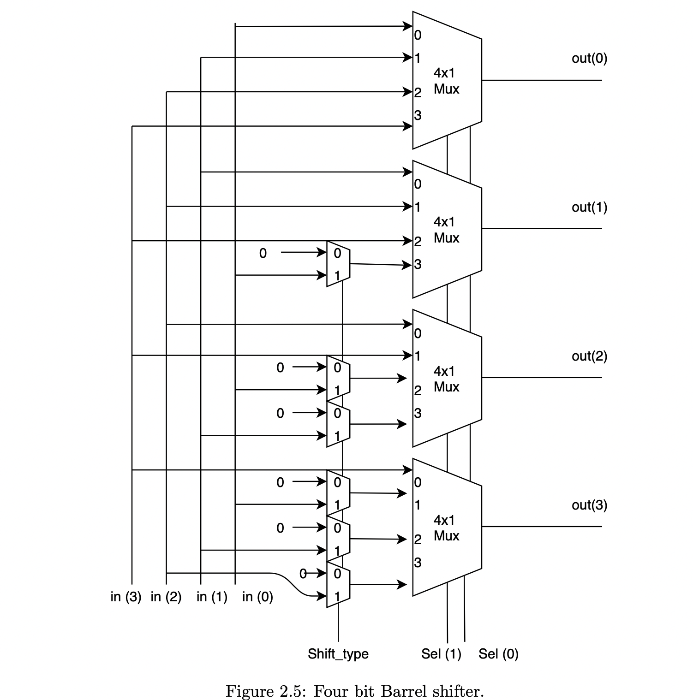
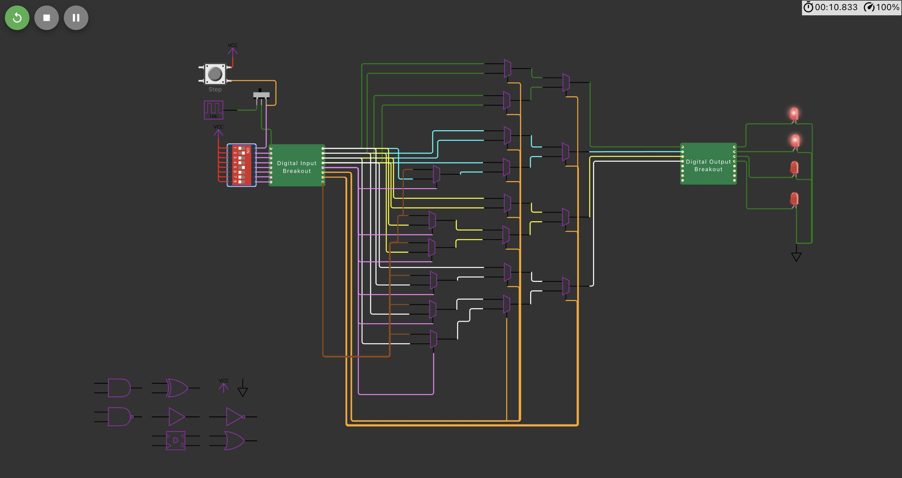
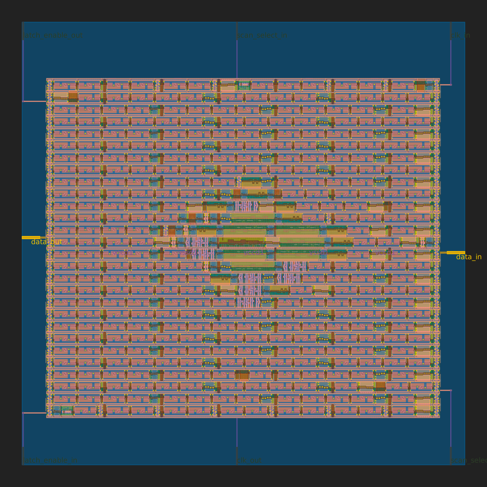

# TinyTapeout Barrel Shifter

4-bit Barrel Shifter made via <a target="_blank" href="https://tintapeout.com">TinyTapout</a> toolchain.

### Config
| PIN | mapped I/O | Wire color |
| ----------- | ----------- | ----------- |
| IN0 | in(0) | Green |
| IN1 | in(1) | Blue |
| IN2 | in(2) | Yellow |
| IN3 | in(3) | White |
| IN4 | shift_type | Pink |
| IN5 | sel(0) | Orange |
| IN6 | sel(1) | Orange |
| IN7 | 0 | Brown |

### Reference Diagram

### Circuit Diagram (<a target="_blank" href="https://wokwi.com/projects/339800239192932947">Wokwi</a>)

## GDS (<a target="_blank" href="https://shahzaibk23.github.io/tinytapeout-barrel-shifter/gds.html">HTML Render</a>)

